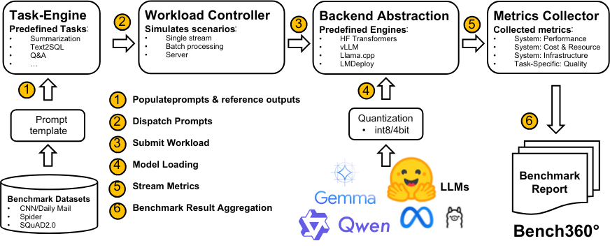

# Bench360 — Benchmarking Local LLMs from 360°

**Bench360** is a modular benchmarking suite for local LLM inference. It offers a full-stack, extensible pipeline to evaluate the latency, throughput, quality, and cost of large language model inference on consumer and enterprise GPUs.

When deploying a large language model (LLM) locally, practitioners must navigate a range of critical trade-offs. Key questions include:

* **Which model architecture** is best suited for my specific task—such as summarization, question answering, or text-to-SQL?
* **What model size** offers the right balance between output quality and system limitations (e.g., available VRAM, latency)?
* **Should I prioritize speed or efficiency** by using reduced precision formats like FP16, or apply more aggressive quantization techniques (e.g., 8-bit, 4-bit)?
* **Which inference backend**—such as vLLM, llama.cpp, Hugging Face Transformers, or DeepSpeed—delivers the best performance for my use case (e.g., low-latency single-stream, high-throughput batch processing, or multi-user server deployment)?
* **How does quantization affect model accuracy in my scenario**, and is the quality degradation acceptable? For example, should we deploy a 7B model in FP16, a 14B model in 8-bit, or a 27B model in 4-bit when VRAM is limited?
* **What hardware configuration** (e.g., consumer GPU vs. data center card) gives the best cost-performance ratio?

Choosing the right combination of architecture, precision, backend, and hardware is essential for optimizing local LLM inference performance, cost, and quality. **Bench360** answers these questions by providing a unified benchmarking framework that covers every part of the local inference stack—not quality or performance metrics. It is designed for model evaluators, systems researchers, and AI engineers who want to understand the trade-offs of real-world deployment. It enables reproducible, apples-to-apples comparison between hardware, models, optimization techniques, and inference engines under realistic scenarios.

## System Overview

[](benchmark/docs/bench360-overview.pdf)

---

## Table of Contents

* [Features](#features)
* [Prerequisites](#prerequisites)
* [Installation](#installation)
* [Cloning the Repository](#cloning-the-repository)
* [Configuration (`config.yaml`)](#configuration-configyaml)
* [CLI Usage](#cli-usage)

  * [Basic Run (Quiet Mode)](#basic-run-quiet-mode)
  * [Verbose Mode](#verbose-mode)
* [Output](#output)
* [Directory Structure](#directory-structure)
* [Contributing](#contributing)
* [License](#license)

---

## Features

* **Multi-backend support**: Hugging Face, vLLM, llama.cpp, DeepSpeed-MII, LMDeploy.
* **Flexible scenarios**: single, batch, and server (Poisson arrival) modes.
* **Supported tasks**: summarization, question answering (QA), and SQL generation.
* **Quality metrics**: Task specific metrics like ROUGE, F1 or AST.
* **Custom tasks**: easily add new tasks by implementing a Task class in `benchmark/tasks`.
* **Latency**: measures average generation latency (e.g., ATL and GL metrics).
* **Throughput**: measures tokens per second (TPS) and sentences per second (SPS).
* **Resource monitoring**: GPU memory, GPU utilization, CPU usage, and power sampling via NVML.
* **Cost estimation**: amortization + energy cost per query.

---

## Prerequisites

* **OS**: Linux (tested on Ubuntu 22.04+)
* **GPU**: NVIDIA with NVML drivers
* **CUDA**: Version 12.xx
* **Python**: 3.8 or newer

Install the following system packages (Ubuntu example):

```bash
sudo apt-get update \
    && sudo apt-get install -y python3 python3-venv python3-pip \
       libllvm15 \
       libcurl4 libssl-dev \
       build-essential
```

Ensure your NVIDIA driver and `nvidia-smi` are installed and accessible.

---

## Installation

1. **Clone** this repo (see next section).
2. **Create** and activate a Python virtual environment:

   ```bash
   python3 -m venv venv
   source venv/bin/activate
   ```
3. **Install** dependencies:

   ```bash
   pip install --upgrade pip
   pip install -r requirements.txt
   ```
---

## Cloning the Repository

```bash
git clone https://github.com/slinusc/fast_llm_inference.git
cd fast_llm_inference
```

---

## Configuration (`config.yaml`)

Create a YAML file (e.g. `config.yaml`) with the following structure:

```yaml
# Choose one: huggingface, vllm, llama.cpp, deepspeed_mii, lmdeploy
backend: vllm

# Local path to model directory or .gguf file
model_path: /home/ubuntu/fast_llm_inference/models/llama-3.1-8B-Instruct
model_name: llama-3.1-8B

# Task to benchmark: summarization, qa, or sql
task: summarization

# Scenario: single, batch, or server
scenario: single

# For single
samples: 128

# For batch (choose only if scenario: batch)
# batch_size: 16

# For server mode (choose only if scenario: server)
#run_time: 60                   # total wall‑clock seconds  
#concurrent_users: 10           # number of concurrent user threads
#requests_per_user_per_min: 10  # arrival rate (Poisson)

# Common options
sample_interval: 0.1       # telemetry sample interval (seconds)
quality_metric: true       # enable quality metrics
```

---

## CLI Usage

We provide a CLI script `launch_benchmark.py`. It reads your YAML config and runs the benchmark.

### Basic Run (Quiet Mode)

Suppresses all internal logs, just prints final summary:

```bash
python launch_benchmark.py config.yaml
```

### Verbose Mode

Show all logs, warnings, and detailed prints:

```bash
python launch_benchmark.py config.yaml --verbose
```

---

## Output

After the run completes, you’ll see:

1. **Benchmark Summary** (vertical, human‑readable table) printed to your terminal.
2. **Per‑query CSV** at `<output_prefix>_details.csv` (e.g. `results/llama-summ-batch_details.csv`).

---

## Directory Structure

```
fast_llm_inference/
├── benchmark/              # core benchmarking code
│   ├── benchmark.py        # ModelBenchmark class
│   ├── backends/           # wrappers for each inference backend
│   ├── lookup/             # look up tables
│   └── tasks/              # task definitions (summarization, QA, SQL)
├── launch_benchmark.py     # CLI wrapper
├── requirements.txt        # Python dependencies
├── config.yaml.sample      # example config file
└── README.md               # this file
```

---

## Contributing

Contributions welcome! Please:

1. Fork and create a branch.
2. Add tests or validate your changes.
3. Submit a pull request.

---

## License

This project is licensed under the MIT License. See [LICENSE](LICENSE) for details.
